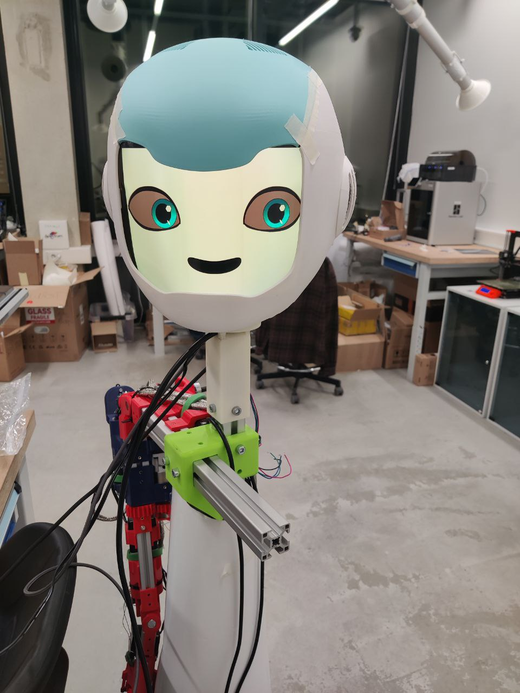
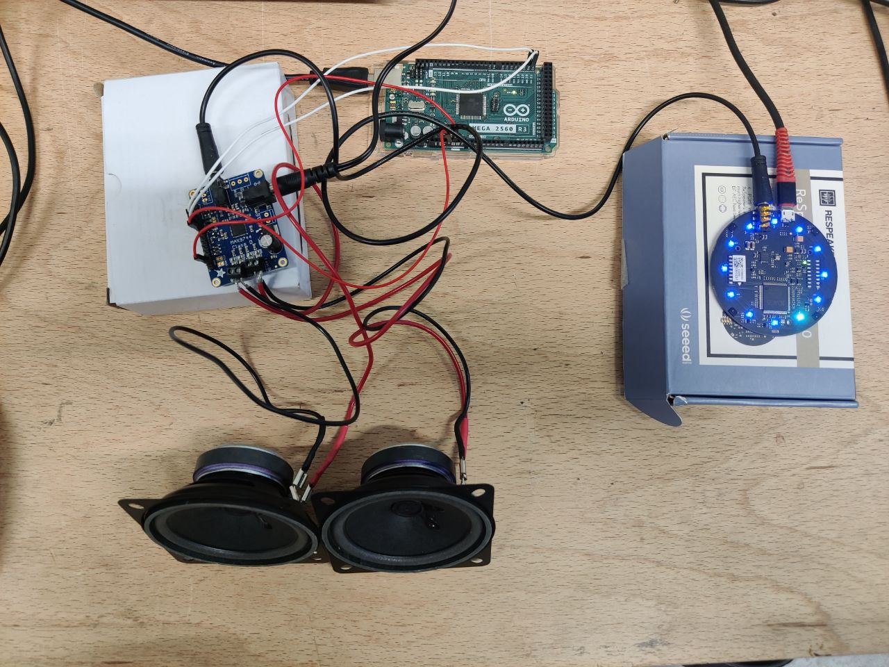
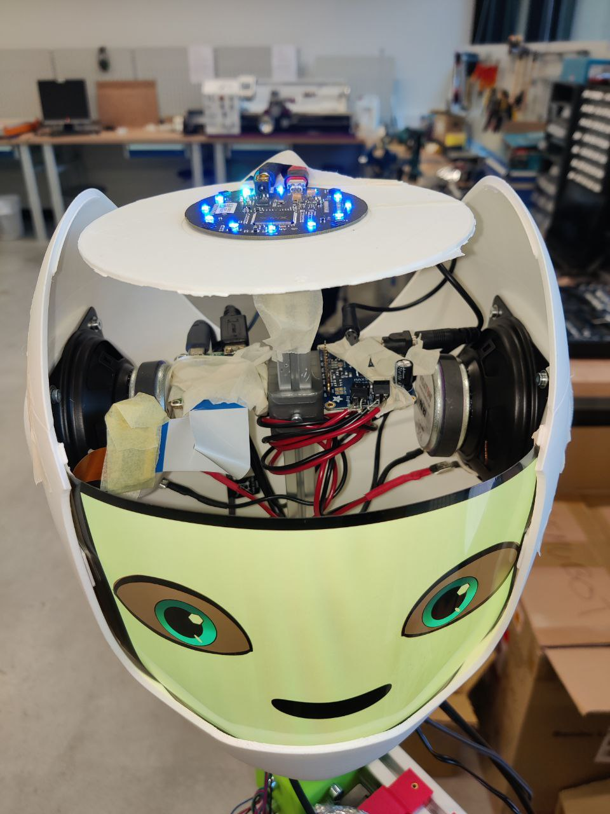

# Semubot hardware audiosystem and ROS2 software integration  
Author: Timur Nizamov  

## ENG
Hello and welcome to the repository of SemuBot's audio system. Here are 5 folders:   
* `Measurements` leads to the Jupyter notebook `snr.ipynb` with tests for the mic-array and graphs; some test scripts and tryouts for the mic-array are also located there.
* `Visuals` is the folder with videos and pictures of my final work for my thesis.
* `respeaker_ros` is a package that contains the data pubslihing node `respeaker_node`, all of the instructions are located in the `README.md` file.
* `semubot_eyes` is a package that contains the subscriber node that accepts the DOA data from the `respeaker_node` and controls the eye movement of the robot's face, the setup instructions are located in the repository's `README.md` file.
* `audio_test` is a test package that contains the subscriber node that accepts the audio stream from `respeaker_node`, puts it into a buffer of 8 seconds and plays it out through the audio system's speakers.

## EST
Tervist ja tere tulemast SemuBoti helisüsteemi hoidlasse. Siin on 5 kausta:   
* `Measurements` viib Jupyteri märkmikusse `snr.ipynb` koos mikrofoni massiivi ja graafikute testidega; seal asuvad ka mõned mikrofonimassiivi testskriptid ja proovid.
* `Visuals` on kaust minu lõputöö videote ja piltidega.
* `respeaker_ros` on pakett, mis sisaldab andmete saatmise sõlme "respeaker_node", kõik juhised asuvad failis "README.md".
* `semubot_eyes` on pakett, mis sisaldab saamise sõlme, mis võtab vastu DOA andmed `respeaker_node`st ja juhib roboti näo silmade liikumist, seadistusjuhised asuvad hoidla failis `README.md`.
* `audio_test` on testpakett, mis sisaldab saamise sõlme, mis võtab vastu helivoogu `respeaker_node`st, paneb selle 8-sekundisse puhvrisse ja esitab selle helisüsteemi kõlarite kaudu.

## Hardware solution/Riistvara lahendus

 

  

